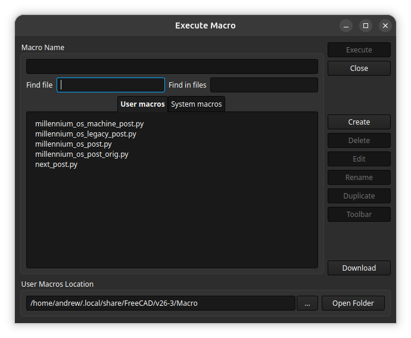

# FreeCAD Post Processors for nxt

Two posts ship here. The **legacy** post is the original argparse-driven one and is unchanged in behaviour. The **machine** post is a port onto the CAM machine-post API introduced in FreeCAD 26.3, where output options come from a machine definition instead of command-line arguments. Machine definitions ship for Milo V1.5, V1.6 beta and V2.0, and for Miley V2.0.

Both can be installed at the same time, so you can post the same job through each and compare. If you need a version of FreeCAD earlier than 26.3 (ie 1.0 or 1.1), you must use the legacy post.

Targets the **nxt v0.7.0** line.

> ## Minimum FreeCAD build: weekly 2026.09.02
>
> Upstream commit [`493bba9e42`](https://github.com/FreeCAD/FreeCAD/commit/493bba9e42) ("switch to Path.Command line-numbering and optimization", authored 2026-07-14, merged late August) **removed `_optimize_gcode()` from `Path/Post/Processor.py`**. Optimization moved from the G-code-string stage to the Path.Command stage, and no string-stage hook replaced it.
>
> This post used to hang its axis-word suppression and its arc-start restatement off `_optimize_gcode()`. On any build carrying that commit the override was simply never called, so the arc-start fix silently vanished from the output and the `(NXT-MODAL-BARRIER)` sentinel leaked into the file. It was verified missing from the 2026.09.02, 2026.09.09 and 2026.09.16 weekly AppImages.
>
> **Both are now ported to the command-stage API** (see "Parity with the legacy post's v0.7.0 fixes"). The consequence is that this post now *requires* the new pipeline: it calls `_optimize_duplicates_doubles()`, which older 26.3 dev builds do not have, and will raise `AttributeError` on them. Use a weekly from 2026.09.02 onward. FreeCAD 1.0/1.1 users were never served by this post anyway — use the legacy one.

## Files

| File | Post name in FreeCAD | Purpose |
|---|---|---|
| `nxt_legacy_post.py` | `nxt-<version>` | the original post, unchanged behaviour |
| `nxt_machine_post.py` | `nxt_machine` | machine-flow port |
| `machines/*.fcm` | — | machine definitions, see below |
| `tools/compare_gcode.py` | — | semantic diff between the two posts' output |

### Included machine definitions

| File | Machine name | Travels (X/Y/Z) | Rapids (X/Y/Z) |
|---|---|---|---|
| `machines/Milo_V1.5.fcm` | Milo V1.5 | 340 / 160 / 120 | 2000 / 2000 / 1000 |
| `machines/Milo_V1.6.fcm` | Milo V1.6 (beta) | 300 / 160 / 120 | 2000 / 2000 / 1000 |
| `machines/Milo_V2.0.fcm` | Milo V2.0 | 348 / 210 / 120 | 2000 / 2000 / 1000 |
| `machines/Miley_V2.0.fcm` | Miley V2.0 | 308 / 210 / 120 | 2000 / 2000 / 1000 |

**Every number in these files is a nominal starting point, not a measurement.** Travels are the published figures, quoted minus endstop; your `M208` soft limits will sit a few mm inside them and hard limits may vary based on your build. Rapids are the published V1.5 figures, used for all four because no rapid speed is published for V2 — yours will depend on motors, drive voltage and whether you fitted leadscrews or ballscrews. The stock LDO spindle is described as 1.5 kW running 7200–24000 rpm, but this is just one common configuration among many. You will need to adjust these for your machine!

There is deliberately **one definition per machine rather than one per possible configuration**. Power, rpm range, cooling, motors and drive voltage all vary between builds, and no useful number of shipped variants would cover that. Copy the definition matching your machine and edit it to fit — see the next section.

**V1.6 is beta.** Its travels and rapids are inherited from V1.5, on the basis that the beta retains the V1.5 frame extrusions, linear rails, leadscrews and motors. The XY and Z plates and the anti-backlash block are new and result in some workarea changes, so verify the limits against your own `M208` on a working machine before use.

---

## Check these against your machine

A `.fcm` is plain JSON and can be edited in a text editor or through the CAM Machine editor in FreeCAD (under Preferences → CAM → Assets). Either way FreeCAD re-reads the file on every post, so changes take effect on the next job with no restart. There is also a validator in the machine editor that checks for common errors.

### These change the G-code

Get these right before cutting.

| Field | Where it comes from | What goes wrong if it is off |
|---|---|---|
| `machine.toolheads[0].min_rpm` | spindle rating / VFD parameters | `Path/Tool/FeedsSpeeds/resolver.py` clamps any calculated speed up to this floor **and scales feeds by the same ratio** to hold chipload. A floor set too high silently raises your feeds; too low lets the spindle run where it has neither cooling nor torque |
| `machine.toolheads[0].max_rpm` | as above | speeds above it are clamped down, again rescaling feeds |
| `postprocessor.properties.nxt_version` | the nxt version in firmware | `M4005` fails and the job will not run |

The shipped floor of 7200 rpm assumes an **air-cooled** spindle, where the shaft fan gives least airflow exactly when torque demand is highest. A water-cooled spindle has no such constraint and can usually take a considerably lower floor — 6000 or below. If you have changed spindle, this is the first field to revisit. **Always check your values here; these are generic common limits in the provided files, but your mileage may vary and getting this wrong can damage your spindle!**

### These should be accurate but do not affect output today

Nothing outside the machine model, the Machine editor and the validator reads these on a 3-axis machine (see "Things that are not what they look like"). They do not change posted G-code, but they are not ignored either: FreeCAD's `Machine/models/validate.py` errors on any linear or rotary axis whose `min_limit >= max_limit`, and warns about keys in the file the loader does not read. The Machine editor runs it on load. So set them correctly — a future release may go further.

| Field | Where it comes from |
|---|---|
| `machine.axes.X/Y/Z.limits.min` and `.max` | RRF `M208` — your configured soft limits, usually a few mm inside nominal travel |
| `machine.axes.X/Y/Z.max_velocity` | RRF `M203` — varies with motors, drive voltage and leadscrew versus ballscrew, so two nominally identical machines can differ |
| `machine.toolheads[0].max_power_kw` | spindle manufacturer's docs |
| `machine.toolheads[0].coolant_mist` / `coolant_flood` | whether you run air blast, mist or flood (note: air as a distinct cooling mode is not currently supported in FreeCAD machine posts) |

> **Note**: `limits.min` must be strictly less than `limits.max` or the definition fails validation.

To read the firmware values, send `M208` and `M203` with no parameters in the nxt console. `M203` takes and reports mm/min, which is what the `.fcm` wants — but the object model (`M409 K"move.axes[0]"`) reports `speed` in mm/s, so multiply by 60 if you read it that way. Also check whether your `config.g` pulls in sub-files with `M98 P"..."`; the values you want may not be in the main file.

### Workflow preferences, not machine facts

These sit in `postprocessor.properties` and are yours to set: `probe_mode` (`AT_START`, `ON_CHANGE`, `NONE`), `home_before_start`, `vssc` with `vssc_period` and `vssc_variance`, `output_tools`, `output_job_setup`, and `allow_zero_rpm`. The shipped values are `ON_CHANGE` probing, homing on, VSSC on at 4000 ms / 200 rpm. Change these to match your needs!

One field is deliberately zero and worth understanding before changing: `toolheads[0].toolhead_wait` is `0.0` because this post emits `M3.9`, which already blocks until the spindle reaches speed. Setting it non-zero adds a `G4` dwell on top, so you would wait twice. Raise it only if your spindle genuinely does not reach speed by the time `M3.9` returns (if you have run the nxt config wizard, this should not be the case).

### Leave these alone unless you know why

Everything in the "Machine definition settings" table below was arrived at by diffing output against the legacy post, and several break the G-code if reverted — `duplicates.commands` strips the command word off `M4000` lines, and `filter_inefficient_moves` deletes rapids whenever upstream wires it back up. That section gives the reason for each.

---

## Installing the legacy post

1. Download `nxt-<version>_post.py` from the [GitHub Release](https://github.com/MillenniumMachines/MOS-nxt/releases) on the same **major.minor** line as installed nxt (e.g. any 0.7.x post with 0.7 firmware; `M4005` ignores beta/rc/patch).
2. Copy it into your FreeCAD **macro directory** (the same folder used for `.FCMacro` files).
3. Restart FreeCAD or refresh the CAM post list if needed.
4. In the CAM workbench, select the post processor whose name matches the file prefix (e.g. `nxt-v0.7.0` for `nxt-v0.7.0_post.py`).

FreeCAD expects post processors to follow the `<prefix>_post.py` naming convention (`_post.py` must be lowercase). See the [FreeCAD CAM post customization guide](https://github.com/FreeCAD/FreeCAD-documentation/blob/main/wiki/CAM_Postprocessor_Customization.md#naming-convention).

## Installing the machine post

1. **Post processor** → copy `nxt_machine_post.py` onto FreeCAD's post search path; the macro directory is the usual choice (on Linux, `~/.local/share/FreeCAD/v<version>/Macro/`). You can also find it by opening the FreeCAD Macros dialog (menu Macro → Macros); the path is shown as User Macros Location at the bottom of the dialog:

   

   **Do not rename this file.** `PostProcessorFactory.get_post_processor()` resolves the class as the filename minus `_post.py`, title-cased — `nxt_machine` → `Nxt_Machine`. A versioned filename would not be a valid identifier, the factory would silently fall back to `WrapperPost`, and posting fails with *"The script does not have an 'export' function"*. This is why the release ships it unversioned while the legacy post keeps its `nxt-<version>_post.py` name.

   The search order is FreeCAD's `defaultFilePath()`, then `macroFilePath()`, then addon post directories, then FreeCAD's own `Path/Post/scripts/`. **The first match wins**, so an older copy in the CAM default file path can silently shadow the one you just installed. To check which file actually loads, run this in FreeCAD's Python console:

   ```python
   import os, Path.Preferences as PP
   print("\n".join(("WINS " if os.path.exists(os.path.join(p, "nxt_machine_post.py")) else "  -  ")
                   + os.path.join(p, "nxt_machine_post.py") for p in PP.searchPathsPost()))
   ```

2. **Machine definitions** → copy the `.fcm` files into `<CAM asset path>/Machines/`. Check the values against your own machine first — see "Check these against your machine". The default asset path is `FreeCAD.getUserAppDataDir()/CamAssets`; check yours with `Path.Preferences.getAssetPath()`.

   > **Note**: this path can also be configured. If you can, create a repo for your CAM assets and point FreeCAD at it — that version-controls not just the machine definitions but the rest of your CAM setup, which is especially worth doing if you work on multiple computers.

3. **Restart FreeCAD.** Confirm the post is classified correctly (Python console):

   ```python
   import Path.Preferences as P
   P.classifyPostProcessor("nxt_machine")   # -> 'machine'
   ```

   If it reports `unknown`, the module raised on import and the classifier swallowed the traceback. The 26.3 machine post API is a moving target, so FreeCAD changes during its development cycle can break this.

4. **In the CAM Job**, set Machine to the entry matching your machine, e.g. `Miley V2.0`. The postprocessor comes from the machine definition, not from the job. It can be set in the Job settings panel on the General tab, or in the job properties view.

5. **Check `nxt_version`** in the machine definition matches your firmware line. The machine post reads it from there, not from `RELEASE.VERSION`. Since v0.7.0, `M4005` compares **major.minor only** (`macros/utilities/M4005.g`), so the shipped `v0.7.0` value covers `v0.7.0-beta.N`, `v0.7.0-rcN` and `v0.7.x` firmware without re-exporting — but crossing a line (0.6 → 0.7) still aborts. The post refuses to post at all if the value is still the `%%NXT_VERSION%%` build placeholder, rather than emitting a bad `M4005`.

---

## nxt-specific divergence from the MillenniumOS post

This post tracks `millennium_os_machine_post.py` in the MillenniumOS repo so the two stay diffable. On the v0.7.0 line there is exactly **one** behavioural divergence.

| Feature | Code | Status in nxt | Handling |
|---|---|---|---|
| Canned-cycle modals | `G80` / `G98` / `G99` | **implemented** (`macros/canned/`), unlike RRF/MillenniumOS | still dropped, for parity with `nxt_legacy_post.py`, which carries `_UNSUPPORTED = [98, 99]` and never emits G80 |

nxt's `G80.g` / `G98.g` / `G99.g` maintain real modal state (`global.nxtCannedCycle`, `global.nxtCannedRetractMode`), so emitting them may well be correct — but it is a behaviour change from what nxt users get today, and it needs validating against a drilling job on real hardware first. See `UNSUPPORTED_MODAL` in `nxt_machine_post.py`.

> **Earlier v0.6.0 divergences, now resolved.** The v0.6.0 port defaulted VSSC off and added a `rotation_compensation` property, because that line shipped no `M7000`/`M7001`/`M5011`. The v0.7.0 line implements all three (`macros/spindle/M7000.g`, `M7001.g`, `nxt-run-vssc.g`, `macros/utilities/M5011.g`), so both special cases are gone and the post matches MillenniumOS again.

> **Still absent on v0.7.0:** `M3000`. The legacy post's `oncomment()` emits `M3000 R"FreeCAD" S"..."` for an operation Comment, which has no macro and will abort. The machine post emits nothing for comments. Pre-existing, untouched by this port.

---

## Parity with the legacy post's v0.7.0 fixes

Both fixes the legacy post gained on this line are carried here:

- **Explicit G1 to arc start after a plane change** (upstream `32d18b0`). RRF takes an arc's start point from the live machine pose rather than from the command, so after a plane change a modal axis word suppressed as unchanged can leave an out-of-plane axis stale and the arc starts from the wrong point. Implemented in `_force_arc_start_after_plane_change()`, porting legacy's `onplane()` / `_forceArcStartPose()` pair: X and Y are restated, never Z, once per plane change.

  **X/Y-only is a deliberate match to the legacy FreeCAD post, and it differs from the Fusion post.** `nxt.cps` restates the two *in-plane* axes — X/Y for `G17`, X/Z for `G18`, Y/Z for `G19`. Both FreeCAD posts restate X/Y whatever the plane, which covers a `G18`→`G17` transition but leaves Z unstated when entering an `XZ` arc. See "Not yet covered".

  **The restatement has to survive two separate suppression passes, and that is most of its design.** It restates the pose the machine is already at, so anything that strips unchanged axis words reduces it to a bare `G1`, which the base then drops as a move with no parameters — the exact silent failure it exists to prevent.

  - `modal_axis()` strips duplicate axis words at the Path.Command stage, in `_optimize_duplicates_doubles()`. Handled by injecting *after* that pass: this post overrides `_optimize_duplicates_doubles()`, calls `super()` first and injects second, so the deduplicator never sees the injected moves. Pose is accumulated rather than read per command, because by then a command carries an axis word only when that axis changed.
  - `_convert_move()` strips them again at conversion, comparing against `machine_state.previous`. Handled in `_convert_linear_move()`: the injected move carries an annotation, and for that command only, the two axis entries in `previous` are blanked for the duration of the call and restored afterwards.

  If you refactor either method, keep that split. An injected move that reaches `modal_axis()`, or that converts without the bypass, comes out as a bare `G1` and silently does nothing.
- **4-decimal axis output** (upstream `42cc6d0`, `AXIS_DECIMALS = 4`, "to satisfy RRF G2/G3 arc tolerance"). Handled via `output.precision.axis: 4` in every shipped machine definition — `dist/verify-post-processor-naming.sh` asserts it, since reverting to 3 reintroduces the defect.

---

## What the base class does now

Removed from the port because the base `PostProcessor` handles it, driven by the machine definition:

| Legacy behaviour | Now controlled by |
|---|---|
| argparse options | property schema, edited in the Machine editor |
| header block | `output.header.*` |
| comment formatting | `output.comments.*` |
| coordinate / feed / spindle precision | `output.precision.*` |
| modal deduplication | `output.duplicates.*` |
| canned cycle expansion | `processing.translate_drill_cycles` |
| G21/G90/G94 | `postprocessor.properties.preamble` |
| park and stop at end | `postprocessor.properties.postamble` |

## What the port overrides, and why

nxt-specific:

- **`_expand_prefix`** — M4005 version check, M4000 tool table, G6511 reference probe, G6600 WCS probing, M7000 VSSC. Job-dependent — it needs the tool list and the set of used WCSs — so it cannot be a static preamble string. Also appends the closing sequence so ordering matches legacy: `M9`, `G27`, `M7001`, `M9`, `M5.9`.
- **`_convert_tool_change`** — emits a bare `T` word; nxt services the change in firmware, so `M6` is suppressed.
- **`_convert_spindle_command`** — appends the `.9` wait suffix (`M3.9`, `M5.9`) so RRF blocks until the spindle is at speed.
- **`_convert_fixture`** — park before a WCS change, optional probe, M5011.
- **`_convert_coolant_command`** — adds the descriptive comment. The M-codes themselves come from `Path/Op/Base.py`, not from the post (see below).
- **`_delay_leading_z`** — defers a leading Z-only move until after the first XY move of each operation. **This one matters for safety**, see below.
- **`get_sanity_checks`** — warns on rotary axes, multiple spindles and a disabled version check.

Compatibility and correctness fixes, each traced to a specific base-class behaviour:

- **`format_parameter`** — strips trailing zeros and normalises `-0` to `0`, so output reads `X141.5` / `F1096` rather than `X141.5000` / `F1096.0`. Also tolerates the base method existing with or without the `command_name` argument, which differs between 26.x builds.
- **`_expand_prefix`** — sets `PARAMETER_ORDER` alphabetically to match legacy; the base default reorders every motion line. Set there rather than in `init_values()` because `apply_configuration_bundle()` resets `self.values` wholesale in Stage 0.
- **`_convert_rapid_move`** — strips `F` from `G0`, and drops a rapid whose axis words were all removed as unchanged. The base's `F_FOR_RAPID_MOVES` check sits in the `elif` of the duplicate-parameter test, so it is unreachable when `output.duplicates.parameters` is false.
- **`_convert_arc_move`** — drops zero-valued `I`/`J`/`K`. The legacy post marked arc offsets `Control.NONZERO`; without this every G17-plane arc carries a spurious `K0`.
- **`_convert_modal_command`** — drops `G80`, `G98`, `G99` (see the divergence table above), and labels `G17`/`G18`/`G19` the way the legacy post does.
- **`_convert_item_commands`** — defers the leading Z-only approach move until after the first XY move. Still live. Note that the base now deduplicates axis words *before* conversion, so this reorder happens after suppression; it is safe because a pure-Z move and an XY move touch disjoint axes, so swapping them cannot invalidate a suppression decision.
- **`_optimize_duplicates_doubles`** — deduplicates as the base does, then injects the arc-start restatements after it. See "Parity with the legacy post's v0.7.0 fixes" for why that order is not negotiable.
- **`_convert_linear_move`** — emits an injected arc-start move in full instead of letting conversion suppress it back to a bare `G1`.

---

## The approach move after a tool change

FreeCAD emits the approach as `G0 Z5` then `G0 X.. Y..`. After a tool change nxt has parked, so the machine sits high and over the toolsetter. Descending to clearance *before* traversing means the descent happens at the park position and the traverse then happens at clearance height — straight through whatever is between, the toolsetter included (ask me how I know).

`_delay_leading_z()` reorders this to XY first, so the traverse stays at the high park height and the descent happens only once above the target. This is the legacy post's `delayed_z` / `xy_seen` behaviour, reset per operation. The held move is flushed before the next *move*, not immediately after the XY, so a coolant-on between them still precedes the descent.

Two deliberate differences from the legacy post: only pure-Z moves are deferred, where legacy deferred any move whose Z changed and so would swallow a combined XYZ move; and anything still held at the end of an operation is flushed rather than dropped, where legacy resets `delayed_z = None` and silently discards it.

---

## Upstream FreeCAD issues worth being aware of

> **Note**: FreeCAD 26.3 is in active development and very much a moving target, so these may change with future builds. Last checked against `origin/main` at `a4ce44d33b` (2026-09-14) and the 2026.09.16 weekly AppImage.

### 1. Suppressing M6 disables the only modal reset — *fixed upstream, workaround now obsolete*

**This no longer applies as described.** It is kept because the workaround is still in the post, and because the same hazard could return if the pipeline moves again.

`suppress_redundant_axes_words()` still exists in `GcodeProcessingUtils.py`, but since `493bba9e42` nothing in the CAM module calls it — its only remaining references are its own unit tests. Deduplication now happens on `Path.Command` objects, in `PathOptimizationUtils.modal_axis()`, and `_deduplicate()` there treats two things as modal barriers:

```python
if previous_command and (
    previous_command.Name in Constants.MCODE_TOOL_CHANGE
    or previous_command.Annotations.get(Constants.ANNOT_MODAL_BARRIER, False)
):
    previous_command = None
```

That fixes the hazard for this post. The original problem was that suppression ran on *output lines*, where our tool change has already been rendered as a bare `T` word, so the `M6` reset never fired. The new stage runs before conversion, where the `M6` command object is still in the stream, so the barrier fires correctly. `_reset_modal_state()` covers the second suppression pass, which `_convert_move()` still does at conversion time against `machine_state.previous`.

`Constants.ANNOT_MODAL_BARRIER` is also the overridable reset hook this section used to ask for. Nothing upstream sets it yet, but a post can, which makes it the right replacement for this post's sentinel-comment approach.

### 1b. `_optimize_gcode()` is gone

Covered in the warning at the top of this file. The short version: `493bba9e42` deleted the string-stage optimization hook, `export2()` now runs `_optimize_duplicates_doubles()` and `_add_line_numbers()` over postables and then converts, and `_convert_job_sections()` joins the resulting lines with no optimization pass at all. Any override of `_optimize_gcode()` is now dead code — this post's has been ported, but FreeCAD still ships one in its own `opensbp_post.py`, whose `super()._optimize_gcode()` call would raise `AttributeError` if anything called it.

The per-operation axis-word suppression that override also carried is simply gone, not ported: it worked around issue 1 above, which upstream has now fixed properly.

FreeCAD's `GcodeProcessingUtils.suppress_redundant_axes_words()` tracks position across the whole G-code body and resets **only** on a line starting with `M6`/`M06`:

```python
if any(stripped.startswith(cmd) for cmd in ["M6", "M06"]):
    current_pos = {k: None for k in current_pos}
```

This post suppresses `M6` because nxt services tool changes in firmware from a bare `T` word. So the reset never fires, position is tracked straight through a park and tool change, and a retract such as `G0 Z5` at the start of an operation is dropped as redundant — leaving a bare `G0` and **no retract before the following XY rapid**. It affects any post that delegates tool changes to firmware, and it is invisible in the output.

Worked around here by emitting a sentinel comment at each operation, tool-change and fixture boundary, splitting the body on it, suppressing each segment independently, then calling the base with suppression disabled. A proper upstream fix would reset on a bare `T` word too, or expose an overridable reset hook.

The legacy post avoids this entirely by calling `_forceAll()` in `onoperation()`, `ontoolchange()` and `onfixture()`.

### 2. Coolant M-codes are hardcoded — *still true*

FreeCAD's `Constants.py` hardcodes the coolant on/off commands:

```python
MCODE_COOLANT_MIST  = ["M7", "M07"]
MCODE_COOLANT_FLOOD = ["M8", "M08"]
MCODE_COOLANT_OFF   = ["M9", "M09"]
```

A non-standard mode such as nxt's `M7.1` air blast (`macros/coolant/M7.1.g`) will not dispatch to `_convert_coolant_command()` and will not be seen by `_expand_coolant_delay()`. Widening those constants, or making them post-overridable, would help any post with a non-standard coolant mode.

---

## Things that are not what they look like

Worth knowing before changing anything here.

- **Coolant M-codes come from FreeCAD, not the post.** `Path/Op/Base.py` inserts `M7`/`M8`/`M9` into the operation's Path around the first and last `GCODE_MOVE`, based on `obj.CoolantMode`. The post only labels them. This is why the machine post contains no coolant emission code at all and still produces correct coolant output.
- **Most machine-definition fields are descriptive only.** Nothing in the CAM module outside the model class and the Machine editor reads axis `limits`, `max_velocity`, `role`, `parent`, `coolant_flood`, `coolant_mist` or `max_power_kw` for a 3-axis machine. The rotary path generators are the only consumers. Fill them in accurately anyway — a future release may start using them.
- **The spindle `min_rpm`/`max_rpm` are not descriptive.** `Path/Tool/FeedsSpeeds/resolver.py` clamps the calculated speed into that range and scales feeds by the same ratio to hold chipload constant. Raising `min_rpm` therefore raises feeds for anything that lands on the floor.
- **`_make_postable(label, [])` is not a dedup barrier.** Still true, and it matters more now: `_edit_command_list(all_postables=True)` calls `edit_fn(..., cmd=None, ...)` for a postable *without* a path, and that `None` is what `_optimize_duplicates_doubles()` treats as a barrier. An empty-contents postable gets a non-`None` but empty `Path`, and `Path.Path` defines no `__bool__` or `__len__`, so `if item.path` is true, the loop iterates zero commands, and `edit_fn` is never called at all. A marker built this way is invisible to both branches. A `str` postable, such as the ones `_expand_prefix()` makes from `PREAMBLE`, *is* a barrier.
- **`supported_commands` is substring-matched.** `convert_command_to_gcode()` does `command.Name not in supported` where `supported` is a newline-joined *string*, so `M3` matches inside `M30`.
- **There is now a `.fcm` validator.** The Machine editor has a **Validate** button for it, and it also runs on load. It checks axis limit ordering, the kinematic chain, that the referenced postprocessor resolves and that its property keys are known, and it reports keys in the file that the loader silently ignored. Worth running after hand-editing a definition.
- **Duplicate suppression has moved twice, and it moved back.** It ran on postables, then on G-code strings (`_optimize_gcode()`), and since `493bba9e42` it runs on postables again (`_optimize_duplicates_doubles()`, plus a second pass at conversion against `machine_state.previous`). This post targets the current arrangement and nothing older. If an override here appears to do nothing, check the method still exists in your build before assuming the logic is wrong.
- **`processing.f_for_rapid_moves` in a `.fcm` is silently dropped.** In `Machine/models/machine.py`, `ProcessingOptions.f_for_rapid_moves = False` has no type annotation, so it is a plain class attribute rather than a dataclass field: `from_dict()` never reads it, `to_dict()` never writes it, and the validator reports it as an ignored key. `_merge_machine_config()` then reads the hardcoded class default. It happens to be `False`, which is what we want, but the `.fcm` value is not what is producing that. The `f` really is kept off `G0` by `_convert_rapid_move()` in this post. (Pre-existing, not part of the recent refactor.)
- **`processing.filter_inefficient_moves` currently does nothing.** `_optimize_g0()` is defined but never called from `export2()`, and as written it would raise `NameError` on an undefined `cmd` if it were. `collapse_g0()` has no live caller. Leave the setting `false` regardless — the method will presumably be wired back up, and `Constants.ANNOT_NO_COLLAPSE_G0` now exists to mark individual rapids as salient.
- **There are now command annotations worth knowing about.** `Constants.ANNOT_MODAL_BARRIER` (do not dedup across this command), `ANNOT_ALLOW_UNSUPPORTED` (skip the `supported_commands` check for this command) and `ANNOT_NO_COLLAPSE_G0`. They are per-`Path.Command` and survive into the optimization stage, which makes them a cleaner mechanism than this post's marker comments.

---

## Machine definition settings

These are not FreeCAD defaults; each was arrived at by comparing output against the legacy post.

| Setting | Value | Why |
|---|---|---|
| `processing.filter_inefficient_moves` | `false` | `collapse_g0()` removed ~1500 rapids on a test job, including the XY approach before every operation. Currently unwired upstream — keep it `false` anyway, it will come back |
| `processing.translate_drill_cycles` | `false` | nxt implements G73/G81/G83 natively |
| `processing.f_for_rapid_moves` | `false` | legacy emits no `F` on `G0`. The `.fcm` key is dropped by the loader (see below); `_convert_rapid_move()` is what actually enforces this |
| `output.duplicates.commands` | `true` | means "emit the command word every line"; `false` suppressed the `M4000` prefix on repeated lines, producing bare parameter lines RRF would reject |
| `output.duplicates.parameters` | `false` | suppress unchanged axis words, as legacy does |
| `output.comments.symbol` | `"("` | `;` produces a file mixing both styles |
| `output.precision.feed` | `0` | legacy truncates feed to whole mm/min |
| `output.precision.axis` | `4` | matches the legacy post's `AXIS_DECIMALS = 4`, required for RRF G2/G3 arc tolerance |
| `toolheads[0].toolhead_wait` | `0.0` | `M3.9` already blocks; a `G4` dwell would double the wait |

The settings above are post behaviour and apply to every machine. The per-machine values — axis limits, rapids, spindle range — are all nominal and are covered in "Check these against your machine".

The shipped definitions cover every machine pack in `macros/nxt-config/machine/` apart from `custom`: Milo V1.5, V1.6 and V2.0, and Miley V2.0. Note that the travels here are the published nominal figures, not the placeholder `M208` values in those packs — set both from your own machine.

---

## Verifying against the legacy post

Post the same job through both, then:

```sh
tools/compare_gcode.py legacy.gcode machine.gcode
```

It normalises line numbers, comments, whitespace, parameter order and numeric precision, then compares command by command, so a clean run means behavioural equivalence rather than textual equivalence.

### Known remaining differences

Verified in the MillenniumOS port across three jobs (5-tool profiling, a 107k-line adaptive job, and a drilling job). All benign:

- **Feed rounding.** Legacy does `int(qty.getValueAs('mm/min'))`; the base rounds. `F919` vs `F920`, about 0.1% on one feed.
- **Feed placement.** The machine post may emit `G1 F920` on its own line where legacy folds the feed into the following move. Both legal.
- **Modal axis words.** The machine post omits an axis word whose value has not changed (`G3 I-1 X29.626`); legacy re-asserts it via `_forceArcParams` / `_forceLinearParams`. Verified equivalent — same motion.
- **One extra `M9`** before `G27`. Legacy's pre-park coolant-off is conditional on coolant being on; this one is unconditional. A no-op when coolant is already off. Remove `M9` from `postprocessor.properties.postamble` for an exact match.
- **Approach ordering.** No longer a difference. `_delay_leading_z()` defers a leading Z-only move until after the first XY move, matching legacy (`G0 X.. Y..` then `G0 Z5`). One refinement over legacy: only *pure*-Z moves are deferred, so a combined XYZ move is left alone, where legacy deferred any move whose Z changed.

The `G17`/`G18`/`G19` arc-start restatement is implemented and reaches the output again, so plane-changing jobs should match legacy on that point — but see the coverage note below.

Those equivalence results predate the `493bba9e42` refactor, so they describe a pipeline that no longer exists. Suppression now happens on `Path.Command` objects rather than output text, which can shift which axis words survive. The comparison is worth re-running on a current build.

### Not yet covered

**Nothing in this port has been verified against nxt firmware on real hardware.** The equivalence above was established for MillenniumOS, not nxt.

`_force_arc_start_after_plane_change()` has unit coverage for its command handling (pose accumulation across deduplicated axis words, once-per-plane-change firing, X/Y-only restatement, ordering against the real `modal_axis()`, and the conversion-stage bypass) but **has never run inside FreeCAD**. It also fires more rarely than you might assume: **no FreeCAD CAM operation emits `G18`/`G19` as a side effect of its toolpath.** Grepping the CAM module, the only operation that emits plane-select codes at all is **Shape**, which has an explicit `ArcPlane` property (`None`/`Auto`/`Variable`) and an `EmitPreamble` flag. ThreadMilling, Slot, Surface and Waterline emit arcs, but in the active plane without switching it. So a plane change reaches this post from a Shape op, or from hand-written G-code in a Custom op.

To exercise it, either use a Shape op with `ArcPlane` set to `Variable` and `EmitPreamble` on, or add a **Custom op** with `PostProcessOutput` **on**, containing a move, then `G18`, then a `G3` with `I`/`K`. With that flag on, `Path/Op/Custom.py` turns each line into a real `Path.Command`, which is what this pass matches on; lines prefixed with `!`, or the whole op with `PostProcessOutput` off, become as-is annotations with an empty command name and bypass the post entirely. Confirm each first arc after a plane change is preceded by a `G1` carrying real X/Y values and not a bare `G1`.

**The restated axes may be wrong for `G18`/`G19`.** Both FreeCAD posts restate X and Y whatever the plane. The arc's `I`/`J`/`K` offsets are relative to its start point *in the arc's own plane*, so entering an `XZ` arc arguably wants X and Z restated, which is what `nxt.cps` does. The FreeCAD behaviour is what legacy has always done and its comment cites a `G18`→`G17` transition, where X/Y is the right pair. Worth resolving across all three posts rather than diverging further — the restatement is a no-op move to the current pose either way, so adding the third axis is cheap.

Additionally, no test job has exercised **multiple fixtures/WCSs** or **probing operations** in either repo. `_convert_fixture()`'s park-before-change branch and its multiline return have never run. The same goes for 4th-axis support — also a moving target in FreeCAD, though support for it is baked into the machine definitions.

---

## Before you cut

The MillenniumOS port this tracks has been tested over a dozen jobs there, but no combination of action and config can be covered, and **nothing here has been run against nxt firmware**. **Dry-run the first real job above the workpiece so you don't break anything!**
